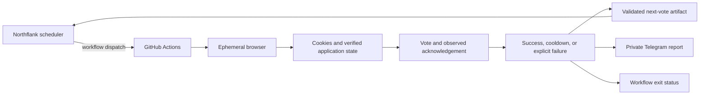

# auto-vote-topgg

Automated daily voting bot for [top.gg](https://top.gg) using nodriver (visible Chrome via Xvfb) + GitHub Actions. Supports multiple Discord accounts and multiple bots.

## Architecture at a Glance



The scheduler follows observed eligibility and bounded retry deadlines. A disappearing challenge widget alone never proves authentication or a completed vote.

## Features

- 🗳️ **External scheduler driven** — Northflank dispatches GitHub Actions from the latest `next-vote` artifact
- ⏱️ **State-aware retry** — success/cooldown and transient failure states all publish a bounded next-attempt timestamp
- 👥 **Multi-account** — vote with multiple Discord tokens and cookie sessions in one run
- 🤖 **Multi-bot** — vote for multiple bots per account
- 🍪 **Cookie-first auth** — injects only top.gg Auth.js cookies, then verifies the session
- 🔐 **OAuth fallback** — uses Discord OAuth when cookies are missing or expired
- ⚡ **Turnstile verification** — dismisses top.gg privacy overlay, then nodriver clicks Cloudflare checkbox during cookie auth, OAuth, pre-vote, post-vote, and verification reload
- 🔒 **Explicit CAPTCHA fallback** — unresolved interactive CAPTCHA is reported and not retried on the same runner
- 🔄 **Fresh-run recovery** — browser-startup failures and persistent protection blocks can dispatch one bounded fresh GitHub runner retry
- 📨 **Telegram notifications** — chunked per-account reports with privacy-safe account fingerprints
- 🔁 **Scoped retry** — retries transient authentication and bot failures without repeating final results
- 📸 **Failure evidence** — always captures CAPTCHA pages and final auth failures for private Telegram; other error screenshots remain opt-in
- 🚦 **Truthful CI status** — incomplete votes report to Telegram, then fail the workflow
- 🧹 **Auto-cleanup** — keeps the latest 30 completed vote-workflow runs for better failure forensics
- 📌 **Reproducible builds** — Python packages and GitHub Actions are pinned to tested immutable versions

## How It Works

```
TOPGG_COOKIES_JSON (same line order as TOKENS)
    ↓ inject top.gg Auth.js cookies
    ↓ inspect vote-page UI + verify /api/auth/session
    ├── vote surface visible → authenticated even if the session endpoint is temporarily blocked
    ├── explicit unauthenticated state → Discord-origin token injection → OAuth Authorize
    └── protection block → one fresh-browser retry, then scheduled backoff
top.gg authenticated
    ↓ navigate to vote page → wait ad → nodriver verify_cf()
    ├── library verification click → observe response/page state; target and acceptance are not guaranteed
    ├── unresolved CAPTCHA → captcha_required (no retry this run)
    ├── cooldown text → bounded timestamp → scheduler waits until that timestamp
    └── verified → click Vote → confirm success/cooldown
```

## Setup

### 1. Fork this repository

Fork to your own GitHub account so you can add Secrets and run Actions.

### 2. Get your Discord Token

> [!CAUTION]
> Discord user tokens are sensitive credentials. Never share them.

**Via Network Tab (recommended):**
1. Open [discord.com](https://discord.com) in your browser → press `F12`
2. Go to **Network** tab → filter by **Fetch/XHR**
3. Click any channel or DM to trigger a request
4. Click any request to `discord.com/api/...`
5. In **Request Headers**, find the `Authorization` header → that's your token

**Via Local Storage:**
1. Open [discord.com](https://discord.com) → press `F12`
2. Go to **Application** tab → **Local Storage** → `https://discord.com`
3. Find key `token` → copy the value (without surrounding quotes)

### 3. Configure GitHub Secrets

Go to your repo **Settings → Secrets and variables → Actions → New repository secret**:

| Secret | Required | Description |
|--------|:--------:|-------------|
| `TOKENS` | ✅ | Discord user token(s) — one per line for multi-account |
| `BOT_IDS` | ✅ | Bot ID(s) to vote for — one per line |
| `TG_BOT_TOKEN` | ❌ | Telegram bot token (from [@BotFather](https://t.me/BotFather)) |
| `TG_CHAT_ID` | ❌ | Telegram chat/user ID for vote result notifications |
| `SEND_ERROR_SCREENSHOTS` | ❌ | Set to `1` for non-CAPTCHA error/uncertain screenshots; CAPTCHA screenshots are automatic |
| `TOPGG_COOKIES_JSON` | ❌ | Full extension JSON export, one line per account matching `TOKENS` order |

At runtime, workflow copies credential secrets into mode-`0600` temporary files, unsets raw values, and passes only file paths to Python. Python reads and unlinks those files before Chrome starts. `BOT_IDS` and `SEND_ERROR_SCREENSHOTS` are non-credential configuration values and remain ordinary environment variables.

**`TOKENS` multi-account example:**
```
NzI4MjA0NDU4MjcxMjg2NzMy.XXXXXX.YYYYYYYYYYYY
OTQxNjM3NDU4MjcxMDA2NDAz.XXXXXX.ZZZZZZZZZZZZ
```

**`TOPGG_COOKIES_JSON` multi-account format:**

Install [Get cookies.txt LOCALLY](https://chromewebstore.google.com/detail/get-cookiestxt-locally/cclelndahbckbenkjhflpdbgdldlbecc) from Chrome Web Store first. Cookie export stays local to browser according to extension listing, but exported Auth.js session data remains a sensitive login credential.

1. Login to top.gg using account 1.
2. Open **Get cookies.txt LOCALLY** on a top.gg page.
3. Select export format **JSON**, then click **Copy**.
4. Paste the copied one-line JSON as line 1 in the secret.
5. Repeat using account 2 and paste as line 2.
6. Use `[]` for an account without exported cookies.

```text
[{"domain":".top.gg","name":"__Secure-authjs.session-token","value":"..."}, ...]
[{"domain":".top.gg","name":"__Secure-authjs.session-token","value":"..."}, ...]
[]
```

The script filters full export automatically and injects only cookie names containing `authjs` for `top.gg`. When this secret exists, its line count must exactly match `TOKENS`; use `[]` for any account without cookies. Before injection, every Auth.js cookie is forced to `Secure` and every session-token cookie is forced to `HttpOnly`, even when extension export omits or misreports those flags. Invalid/misaligned exports fail before browser startup without printing cookie values.

> [!CAUTION]
> Auth.js session cookies are login credentials. Store them only in GitHub Secrets; never commit or share them.

**`BOT_IDS` multi-bot example:**
```
830530156048285716
123456789012345678
```

### 4. Enable GitHub Actions

Go to your repo **Actions** tab → click **"I understand my workflows, go ahead and enable them"**.

## Automatic Schedule and Retry

This fork uses the persistent service in `scheduler/` as the scheduler. The service runs on Northflank and dispatches `.github/workflows/vote.yml` with `workflow_dispatch`; there is no GitHub cron in `vote.yml`.

After every run, `vote.py` writes a private one-day `next-vote` artifact containing only a bounded UTC epoch:

```json
{"next_vote_at": 1786334400}
```

Confirmed success normally schedules the next attempt about 12 hours later. Parsed top.gg cooldowns use the reported duration plus the safety buffer. Protection blocks, CAPTCHA states, and other transient failures also receive bounded retry times, so a failed run does not cause the external scheduler to dispatch again every minute.

The Northflank scheduler waits for an active vote workflow instead of dispatching a duplicate, validates schedule timestamps, retries transient GitHub API reads with backoff, waits at least five minutes after a failed run with no usable schedule, imposes a maximum workflow wait, and periodically refreshes the latest vote artifact while sleeping. Refreshes never accept an older run ID, and short retries from newer failed runs cannot advance a still-future schedule from the most recent successful run. A final schedule check also runs before dispatch. Required environment values are `GH_TOKEN`, `GH_REPOSITORY`, `GH_REF`, and `GH_WORKFLOW`; optional timing controls are `POLL_SECONDS`, `ERROR_RETRY_SECONDS`, and `MAX_RUN_WAIT_SECONDS`.

Accepted run IDs and deadlines are retained across dispatch cycles. When the run list is stale, the scheduler queries the known run directly. A failed run's longer backoff is also respected: the later of its deadline and a previous successful future deadline wins. `SCHEDULE_REFRESH_SECONDS` controls refresh frequency (default 60 seconds). Changes under `scheduler/` take effect after rebuilding and redeploying the Northflank service; merging this repository alone does not prove that the running service uses the new image.


### Fresh-Run Recovery

Chrome startup may occasionally outlive nodriver's short initial DevTools polling window on a GitHub-hosted runner. The runtime now bounds the initial start call, gives a still-running Chrome process an additional late-attach window, and retries more than the historical five-attempt limit. The workflow also creates a valid D-Bus session when the runner provides `dbus-run-session`, while preserving Xvfb. If all accounts still fail with a browser startup error, `vote.py` writes a credential-free marker artifact:

```json
{"reason":"browser_startup_failed"}
```

The workflow reads this artifact and may dispatch a fresh `vote.yml` run on a new runner. Persistent top.gg protection blocks use the same bounded pattern with a separate `protection-retry` marker. Retry runs are identified by `source=browser-startup-retry` or `source=protection-retry`, `origin_run_id=<original-run-id>`, and an internal recovery depth.

Guards:
- At most two fresh runs are allowed across one recovery chain.
- The same failure category cannot dispatch itself twice; a cross-category recovery (for example protection block followed by browser-startup failure) is still allowed within the depth limit.
- Only first attempt (`run_attempt == 1`) may dispatch.
- Marker artifact contains no tokens, cookies, account IDs, bot IDs, or screenshots.
- Original failed run remains a truthful failure; Telegram error report is sent before retry starts.

## Debugging

### Cloudflare 403 diagnosis

The retained September 24 runs returned `403`, `text/html`, and `cf-mitigated: challenge` from `/api/auth/session`. This identifies a Cloudflare Challenge Page, not an expired Auth.js cookie. The exact WAF rule and IP reputation are not exposed by those logs. See the [full review and run evidence](docs/audit-2026-09-24.md).

After a detected challenge, authentication waits for recognizable application UI before requesting the session endpoint. Managed challenge titles and DOM containers also count as protection; a transiently missing widget is not logged as verified access. Session requests have a 12-second browser timeout plus a bounded outer wait, so a hanging fetch cannot consume the entire workflow run.

[Cloudflare documents](https://developers.cloudflare.com/cloudflare-challenges/challenge-types/challenge-pages/detect-response/) `cf-mitigated: challenge` as the response marker. Its [supported-browser guidance](https://developers.cloudflare.com/cloudflare-challenges/reference/supported-browsers/) does not support automated browsers for production challenges. These changes reduce avoidable requests and report denial accurately; they cannot guarantee that top.gg will authorize an automated browser. Persistent denial requires resolution with the site operator or normal interactive access.

To enable verbose diagnostic logging locally, set `DEBUG=1`:

```bash
# Windows
set DEBUG=1 && python vote.py

# Linux / macOS
DEBUG=1 python vote.py
```

Non-CAPTCHA error screenshots remain disabled unless `SEND_ERROR_SCREENSHOTS=1` is set, except final top.gg authentication failures which are captured automatically on the last retry.

A Vote click alone is not success. The browser first looks for a **new acknowledgement on the current bot page**: strong success/cooldown text absent before the click, observed in two consecutive checks, with no enabled Vote button, active challenge, login requirement, or explicit error. This records application acknowledgement without a navigation that could trigger Cloudflare. It does not claim an independently queried server receipt. A pre-existing phrase or a still-enabled Vote button cannot confirm the vote.

If no such acknowledgement appears, the existing independent page-reload check remains a fallback. A post-click result that cannot be confirmed retains `vote_submitted` and its original outcome. It is not clicked again during that run, and no automatic fresh-workflow recovery is dispatched while any submission remains unconfirmed. Other bots can still retry within the current run. Unconfirmed outcomes remain failures, rather than being silently turned green; normal scheduled/manual runs are not deduplicated across runs by this in-memory flag.

CAPTCHA/Turnstile challenges are solved first with nodriver `verify_cf()` wherever they appear: top.gg cookie authentication, Discord OAuth, before voting, after clicking `Vote`, and after vote verification reload. During top.gg authentication the runtime clears an active Turnstile before probing the Auth.js session endpoint, avoiding predictable protection-page 403 requests while the challenge is still active. For a denied session request, logs record only HTTP status and safe Cloudflare classification metadata (`cf-mitigated`, `cf-ray` if exposed), never response HTML or credentials. A 403 with server=cloudflare alone does not prove that a WAF rule blocked the request; an explicit `cf-mitigated: challenge` header is more specific. This improves diagnosis; it does not override a denial. top.gg privacy-consent overlays are checked repeatedly after page open/reload, then dismissed before auth probes, every marked click, vote interaction, and solver clicks so they cannot cover the checkbox or `Vote` button. If privacy-modal dismissal fails while the modal is detected, one screenshot plus the dismiss error is sent to Telegram. If solver cannot clear the challenge, the current browser page is captured when possible and sent to the configured Telegram chat immediately after the text report. Final `auth_failed` results also capture the last browser state and send it after the text report. No `SEND_ERROR_SCREENSHOTS` secret is required for CAPTCHA or final auth-failure evidence.

For other GitHub Actions diagnostics, add repository secret `SEND_ERROR_SCREENSHOTS=1`. Error and uncertain states then send screenshots to configured Telegram chat. Keep chat private: screenshots may contain Discord username, avatar, or top.gg account details. Screenshots are never uploaded as GitHub artifacts and local files are deleted after each Telegram delivery attempt.

> [!WARNING]
> Use ephemeral, single-tenant GitHub-hosted runners only. Do not run this project on persistent/shared self-hosted runners: browser processes handle live account credentials and temporary profiles.

Transient authentication/browser failures before submission retry up to 3 times. Protection-blocked authentication uses at most two browser attempts before deferring to the external scheduler. In multi-bot runs, `error` or `uncertain` results retry only if no Vote submission may have occurred; `success`, `cooldown`, and `captcha_required` are final for the current run. Interactive CAPTCHA is intentionally not retried on the same runner/IP. Telegram reports identify accounts using a short SHA-256 fingerprint, never token fragments, and split automatically below Telegram's message limit.

Completed per-bot results survive later browser failures and authentication failures on a retry. Missing results become explicit errors. Duplicate bot IDs are collapsed while preserving order. All branches share one workflow concurrency group, and artifact validation/upload failures fail the workflow even when the voting process exits successfully.

- `success`, `cooldown`: final on the current runner/IP.
- A cooldown with a valid duration schedules an isolated dispatcher instead of sleeping/retrying on the same runner.
- `captcha_required`: final on the current runner/IP.
- `error`, `auth_failed`, `uncertain` before submission: retry up to 3 times.
- `blocked` before submission: one fresh-browser retry, then a scheduled backoff.
- Unconfirmed post-click outcomes: preserve the result and defer; no immediate resubmission or fresh-workflow recovery.

`error`, `auth_failed`, `uncertain`, or `captcha_required` sends its report first, then exits non-zero so GitHub Actions shows failure.

## Project Structure

```text
auto-vote-topgg/
├── vote.py                          # Auth, vote, cooldown state, report, browser lifecycle
├── test_vote.py                     # Vote/auth/browser unit and regression tests
├── test_vote_regressions.py         # Partial results, bounded probes, browser-script regressions
├── test_scheduler.py                # Scheduler validation and dispatch regression tests
├── scheduler/
│   ├── Dockerfile                   # Northflank scheduler image
│   └── scheduler.py                 # Artifact-driven GitHub workflow dispatcher
├── audit_dependencies.py            # Stdlib OSV dependency audit
├── requirements.txt                 # Direct Python dependencies
├── requirements.lock                # Linux/Python 3.11 hashes and transitive pins
├── README.md                        # Setup and operating guide
├── SECURITY.md                      # Disclosure and credential policy
├── docs/
│   └── audit-2026-09-24.md           # Review findings, run evidence, and deployment limits
├── .github/
│   ├── CODEOWNERS                   # Sensitive-file ownership
│   ├── dependabot.yml               # Weekly pip/Actions updates
│   └── workflows/
│       ├── security.yml             # Tests, syntax checks, dependency audit
│       └── vote.yml                 # Secret handoff, vote, artifacts, cleanup
└── .gitignore
```

## Requirements

- Python 3.11+
- `nodriver==0.50.3`, `opencv-python-headless==5.0.0.93`, and `requests==2.34.2` as direct dependencies
- Hash-locked Linux x86_64 / CPython 3.11 dependencies in `requirements.lock`
- Google Chrome/Chromium from the pinned `ubuntu-24.04` GitHub-hosted runner image (discovered dynamically by workflow)
- Xvfb on headless Linux runners (the workflow uses the preinstalled copy when available and installs it only if missing)

`opencv-python-headless` is required by nodriver `verify_cf()`: nodriver captures the viewport, matches its bundled Cloudflare checkbox template, then dispatches a native mouse click. The headless package supplies image matching without OpenCV GUI components.

### Local install

`requirements.lock` intentionally targets GitHub's Linux x86_64 / CPython 3.11 runner. For local development on Windows, macOS, or another Python ABI, install reviewed direct pins:

```bash
python -m pip install -r requirements.txt
```

### GitHub Actions install

CI verifies exact Linux wheels with:

```bash
python -m pip install --require-hashes -r requirements.lock
```

Run local checks:

```bash
python -m unittest -v
python -m py_compile vote.py test_vote.py test_scheduler.py audit_dependencies.py scheduler/scheduler.py
python -m pip check
python audit_dependencies.py requirements.lock
```

Dependabot checks pip and GitHub Actions weekly. Regenerate lock by downloading CPython 3.11 Linux x86_64 wheels for `requirements.txt`, recording exact transitive versions, and adding each wheel SHA-256. Verify resulting install on GitHub Actions before merging.

Use pull requests and wait for `test`, `dependency-audit`, and `scheduler-image` to pass before merging. Repository settings are separate from this code: the September 24 review found `master` unprotected and no repository rulesets, so these checks were not enforced by branch protection at that time.

## ⚠️ Disclaimer

This project automates interactions using Discord user tokens. Using self-bots violates [Discord's Terms of Service](https://discord.com/terms). Use at your own risk. The author is not responsible for any account bans or other consequences.
